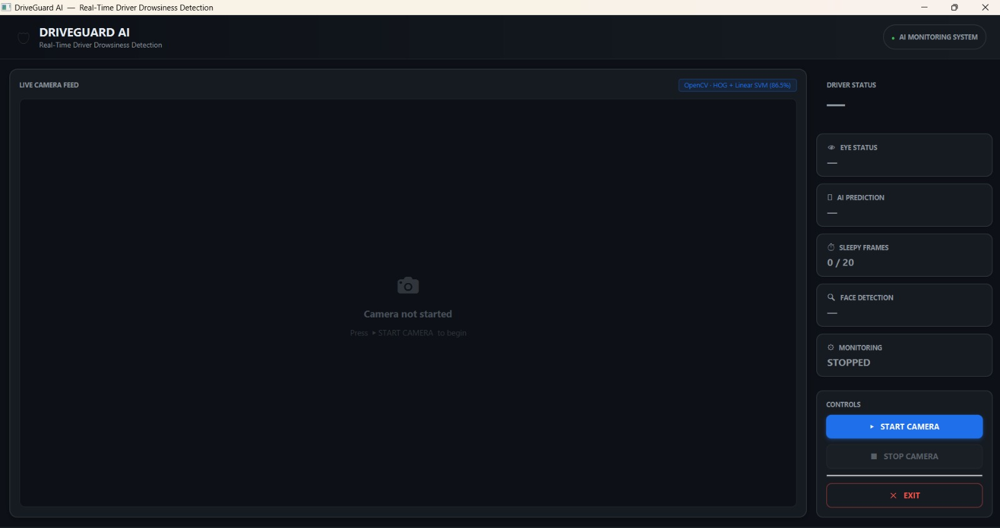
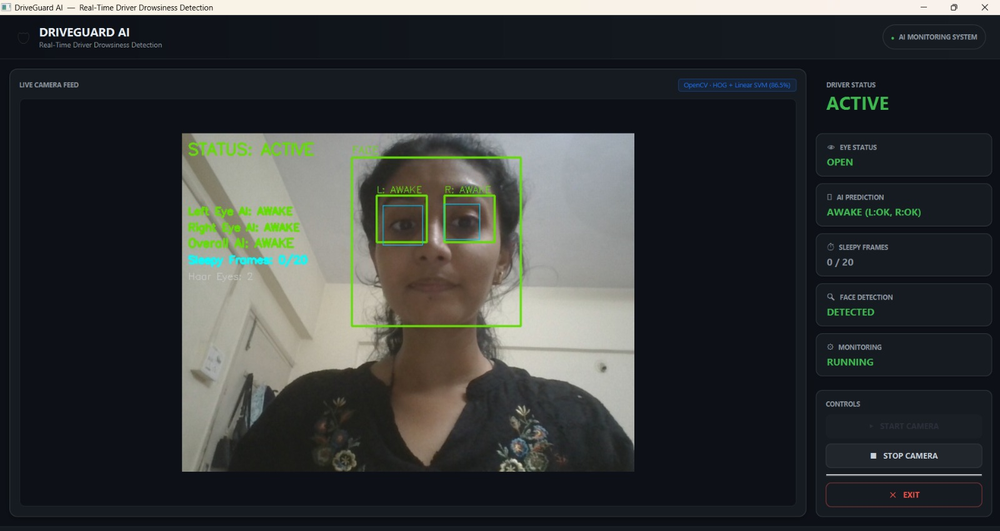
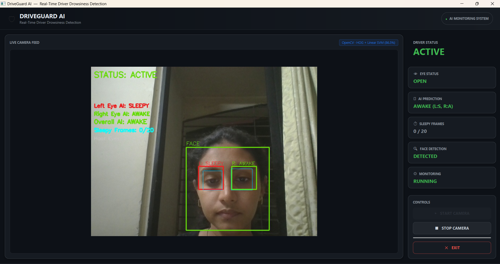
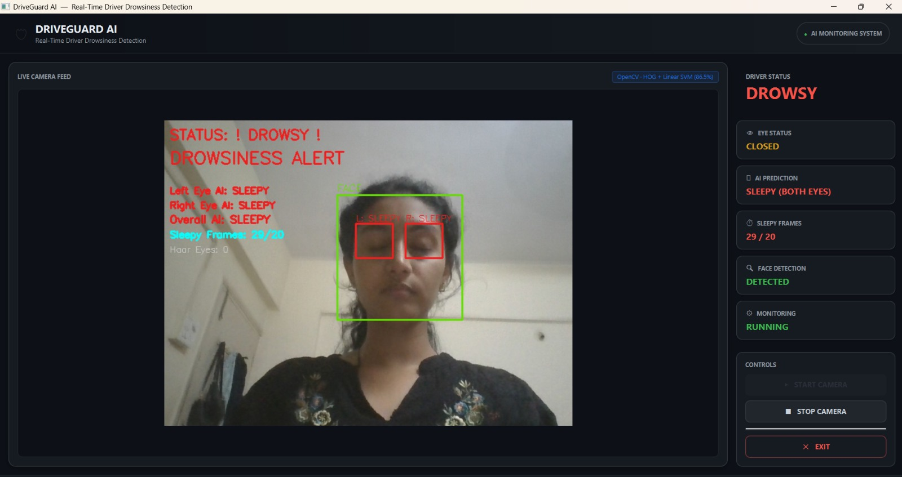

# 🚗 AI-Based Real-Time Driver Drowsiness Detection and Alert System Using HOG and SVM

An AI-based real-time driver drowsiness detection system that uses **HOG (Histogram of Oriented Gradients) and Linear SVM** to classify the driver's eyes as **AWAKE or SLEEPY** and generate an alert when prolonged drowsiness is detected.

## 🎯 Objectives

- Detect the driver's face using a webcam.
- Extract eye regions in real time.
- Classify eye state using a trained AI/ML model.
- Detect prolonged drowsiness.
- Generate a visual and audio alert.

## 🤖 AI/ML

**Dataset:** MRL Eye Dataset  
**Features:** HOG  
**Model:** Linear SVM  
**Input:** 32 × 32 eye images  
**Classes:** AWAKE / SLEEPY  
**Training:** 5,000 awake + 5,000 sleepy images

### Model Performance

**Test Accuracy: 86.26%**

| Metric | Sleepy |
|---|---:|
| Precision | 85.64% |
| Recall | 86.72% |
| F1-Score | 86.18% |

## ⚙️ Technologies

- Java 21
- OpenCV
- JavaFX
- Maven
- HOG
- Linear SVM

## 🔄 Working

```text
Webcam
   ↓
Face Detection
   ↓
Eye Region Extraction
   ↓
Image Preprocessing
   ↓
HOG Features
   ↓
Linear SVM
   ↓
AWAKE / SLEEPY
   ↓
Drowsiness Detection
   ↓
Alert
The system considers 20 consecutive sleepy frames as drowsiness and triggers an alert.


## 📸 Screenshots

### Main Dashboard



### Awake Detection



### Sleepy Detection



### Drowsiness Alert




## ▶️ How to Run
Prerequisites

Install:

Java 21
Maven
Webcam

Verify Java:

java -version

Verify Maven:

mvn -version
Clone the Repository
git clone <YOUR_GITHUB_REPOSITORY_URL>
cd AI_Driver_Drowsiness_Detection
Compile the Project
mvn clean compile
Run the Application
mvn javafx:run

Allow webcam access when prompted.


## 📚 Reference

Inspired by the research paper:

"AI-based Extended Driver Drowsiness Detection and Notification Framework System" – ICOSEC 2025


## 👩‍💻 Author

Merin Joys
Individual Academic Project